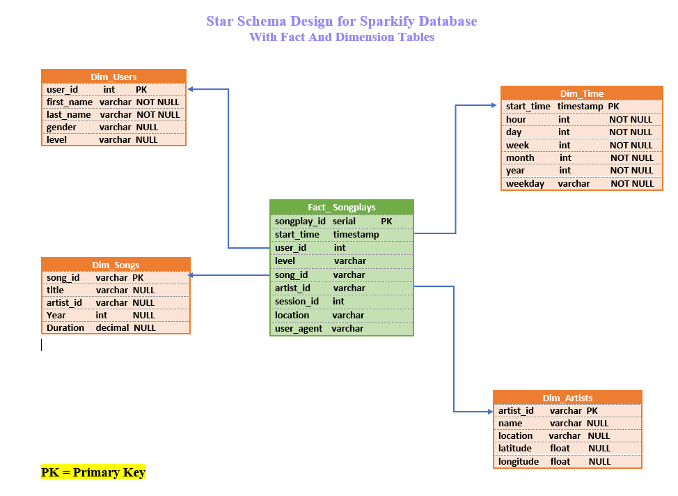

# Project : Data Modeling with Postgres

## Current Scenario
1. A startup named Sparkify collects data on songs and user activity on their
   new music streaming app.  
   More specifically, they want to analyze this data.
   
2. The analytics team wants to know what songs their users are listening to

3. Their data comprises a directory of JSON logs on user activity on the app and
   a directory with   
   JSON metadata on the songs in their app.

## Sparkify's Goals
   The newly hired Data Engineer :
   * should create a Postgres database with tables that will optimize queries 
     on song play analysis

## Data Engineer Role
   1. Create a database schema and ETL pipeline for data analysis
   2. Test database and ETL pipeline by creating and running queries
   3. Compare results with the expected results of the Analytics team
   4. Document the entire process

### Project Steps

#### A. Schema Design 

 
**The Star Schema was selected for the following reasons:**
* Queries are simplified
* Aggregations are fast
* We can denormalize our tables and it will simplify our queries

#### B. Datasets, Python Scripts and Jupyter Notebooks
#### B.1 Song Dataset
1. This dataset is a subset of real data from the Million Song Dataset in JSON format 
   <a href = "http://millionsongdataset.com">millionsongdataset.com</a>
2. Each file contains metadata about a song and the artist of that song. 
3. The files are partitioned by the first three letters of each song's track ID.  
For example, here are filepaths to two files in this dataset. 
**song_data/A/B/C/TRABCEI128F424C983.json 
song_data/A/A/B/TRAABJL12903CDCF1A.json**

**Below is an example of TRAABJL12903CDCF1A.json**  
{ 
"num_songs": 1,  
"artist_id": "ARJIE2Y1187B994AB7",   
"artist_latitude": null,  
"artist_longitude": null,  
"artist_location": "",  
"artist_name": "Line Renaud",  
"song_id": "SOUPIRU12A6D4FA1E1",  
"title": "Der Kleine Dompfaff",  
"duration": 152.92036, "year": 0  
}  

#### B.2 Log Datasets 
1. This dataset consists of log files in JSON format generated by
2. The log files in the dataset are partitioned by year and month 
log_data/2018/11/2018-11-12-events.json  
**Below is an example of the first file : log_data/2018/11/2018-11-01-events.json** 
{ 
"artist":null, 
"auth":"Logged In", 
"firstName":"Walter", 
"gender":"M", 
"itemInSession":0, 
"lastName":"Frye", 
"length":null, 
"level":"free", 
"location":"San Francisco-Oakland-Hayward, CA", 
"method":"GET", 
"page":"Home", 
"registration":1540919166796.0, 
"sessionId":38, 
"song":null, 
"status":200, 
"ts":1541105830796, 
"userAgent":"\"Mozilla\/5.0 (Macintosh; Intel Mac OS X 10_9_4) AppleWebKit\/537.36 (KHTML, like Gecko) Chrome\/36.0.1985.143 Safari\/537.36\"", 
"userId":"39"} 

#### B.3 Scripts and Notebooks

| Python Scripts / Jupyter Notebooks | Purpose                                  |
|------------------------------------|------------------------------------------|
| 1.   create_tables.py              | 1.1  drops the sparkify database if it exists|
|                                    | 1.2  creates the sparkify database |
|                                    | 1.3  makes connection to sparkify and gets a cursor to it |
|                                    | 1.4  drops tables if they exist |
|                                    | 1.5  creates the 5 tables as per the schema design |
|                                    | 1.6  invokes sql_queries to get the create and drop table |
|                                    | queries |
|                                    | | 
| 2.   sql_queries.py                | 2.1 contains drop table statements for all the 5 tables |
|                                    | 2.2 contains create table statements for all the 5 tables |
|                                    | 2.3 contains insert table statements for all the 5 tables |
|                                    | 2.4 contains a query that selects song and artist info  |
|                                    | |
| 3.   etl.py                        | 3.1 Establishes a connection to sparkify database |
|                                    | 3.2 Processes the song file |
|                                    |     a. retrieves the first song file in JSON file format |
|                                    |     b. inserts a song record |
|                                    |     c. inserts an artist record |
|                                    | 3.3 Processes the log file |
|                                    |     a. retrieves the first log file in JSON file format |
|                                    |     b. filter by NextSong |
|                                    |     c. insert time data records |
|                                    |     d. load user table and insert records into this table |
|                                    |     e. insert songplay records with data from song and artist |
|                                    |        tables |
|                                    | |
| 4.   etl.ipynb                     | 4.1  Contains instructions to develop ETL processes for each |
|                                    |      table |
|                                    | |
| 5.   test.ipynb                    | 5.1  Run this script at the end of each table section in |
|                                    | etl.ipynb to confirm that records were successfully inserted |

#### C. Create Tables  
#### C.1 Fact and Dimension Tables

| No of Tables | Table Name | Table Type | Created By       | Tested By  |
|--------------|------------|------------|------------------|------------|
|      1       | songplays  | Fact       | create_tables.py | test.ipynb |
|      2       | artists    | Dimension  | create_tables.py | test.ipynb |
|      3       | songs      | Dimension  | create_tables.py | test.ipynb |
|      4       | time       | Dimension  | create_tables.py | test.ipynb |
|      5       | users      | Dimension  | create_tables.py | test.ipynb |

#### C.1 Implementation for Creation of Tables
a. Run the python script from the terminal in the workspace 
   **$ python create_tables.py** 
   The above command should be run to reset all the five tables before the ETL scripts are run each time.  

#### D. Build ETL Processes
1. ETL Processes were developed for each table in the jupyter notebook, 
   <b>etl.ipynb</b>
2. To confirm that records were successfully inserted into each table,
   <b>test.ipynb</b> was run at the end of each table section
3. <b>create_tables.py</b> was re-run to reset tables before running the notebook,
   test.ipynb, each time
   
#### D.1  Implementation for ETL Processes
At the workspace terminal, type the following in sequence:
1. $ **python create_tables.py**
2. run the jupyter notebook **etl.ipynb**
3. run the jupyter notebook **test.ipynb** after restarting kernel

#### E. Build ETL Pipeline
1. <b>Completed etl.py</b> (based on the completion of etl.ipynb) to process the entire datasets
2. <b>Executed create_tables.py</b> before running etl.py to reset tables.
3. <b>Executed test.ipynb</b> to confirm that records were successfully inserted into each table

#### E.1 Implementation of the ETL Pipeline
At the workspace type the following in sequence:
1. $ python create_tables.py
2. $ python etl.py
3. $ Refresh / Restart the kernel for test.ipynb and run this notebook

#### F. Python and Notebook Environment
1. **Running in Udacity Workspace** 
   Python 3, python packages, jupyter notebooks, and terminal/console  are available 

2. **Running Locally** 
   a. Anaconda Installation and Documentation for Windows  
   <a href="https://www.anaconda.com/products/individual#windows">Install Anaconda for Windows</a> 
   <a href ="https://docs.anaconda.com/anaconda/install/windows/">Anaconda Docs for Windows Installation</a> 
   b. Manage Conda Environment 
   <a href="https://conda.io/projects/conda/en/latest/user-guide/tasks/manage-environments.html"> Conda Envt.</a> 
   c. Install packages using pip after activating conda environment in git bash 
      * psycopg2-binary
      * pandas
      * numpy
      * jupyter
      * ipython-sql
  
#### G Results
1. Running etl.py shows the number of files processed: 
   **song_data : 73** 
   **log_data  : 30** 
2. Additional queries were added to notebook test.ipynb 
   Using aggregate function count for artists and songs tables 
   **No of artists : 69** in the artists table  
   **no of songs   : 71** in the songs table 
   **No of users   : 96** in the users table
   **No of songplays : 7150** in the songplays table 
3. There is just one record without a null or None for **artist_id** and **song_id** in songplays

| songplayID | userID | level | artistID          | songID             | location |
|------------|--------|-------|-------------------|--------------------|----------|
| 4108       | 15     | paid  | ARKOSW1187BF35FF4 | SOZCTXZ12AB0182364 | IL-IN-WI |

4. Free versus Paid users (from users table)

| Level | Count |
|-------|-------|
| Free  | 75    |
| Paid  | 21    |

#### H. Things to Consider for Sparkify
* What music selections should be added to increase the number of paid users?
* What incentives should be provided to change free users to paid users? 

#### References
1. Get first/last n rows of a dataframe 
<a href="https://riptutorial.com/pandas/example/21739/get-the-first-last-n-rows-of-a-dataframe">Rows of dataframe</a> 
2. <a href="https://moonbooks.org/Articles/How-to-get-the-names-titles-or-labels-of-a-pandas-data-frame-in-python-/">Titles and Labels of a Pandas Dataframe</a> 
3. <a href="https://thispointer.com/python-pandas-how-to-get-column-and-row-names-in-dataframe/">Python
Pandas : How to get column and row names in DataFrame</a> 
4. <a href="https://www.geeksforgeeks.org/formatting-integer-column-of-dataframe-in-pandas/">Formatting  integer column of dataframe in pandas</a>
5. <a href="https://pandas.pydata.org/pandas-docs/stable/reference/api/pandas.to_datetime.html">pandas-to-datetime</a>